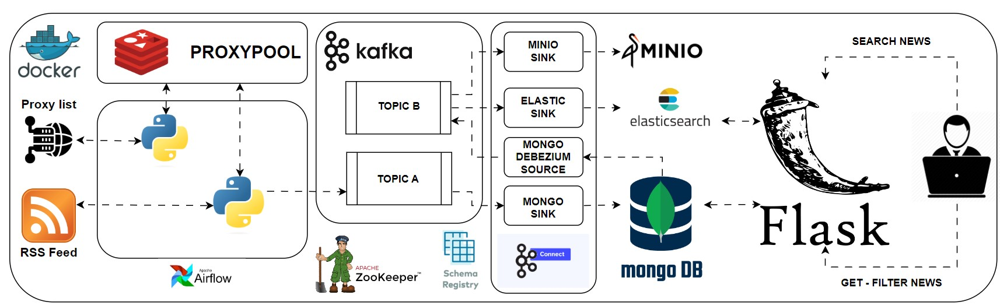

# Building_RSS_Feed_Pipeline_With_OpenSource
Building a Data Pipeline: Integrating Proxy Rotation, Airflow, Flask, CDC_Kafka, MongoDB, Redis, Elasticsearch, and MinIO for Web Scraping
<!-- ARCHITECTURE DIAGRAM -->
## Architecture diagram

